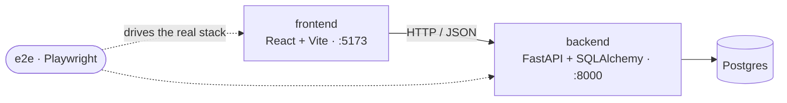
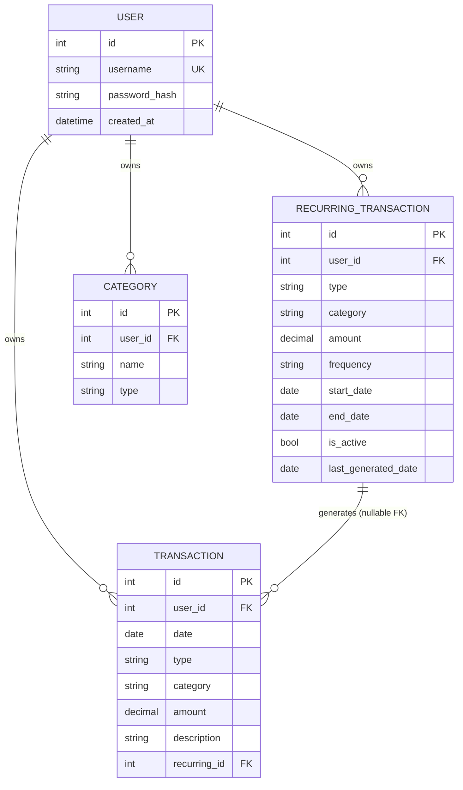

# Architecture

Fintracker is a small monorepo with a Python API, a React single-page app, and an
end-to-end test suite. It's designed for a single local user — there is no
authentication or multi-tenancy.



The frontend talks to the API over JSON. CORS allows only the Vite dev origin
(`http://localhost:5173`), and the frontend's API base defaults to
`http://localhost:8000` (override with `VITE_API_URL`).

## Backend

FastAPI app under [`backend/app/`](backend/app/), organized in layers:

```
main.py            App factory: CORS, lifespan (init DB + backfill), router mounting
core/config.py     Settings (project name, API prefix, DB URL, CORS origins, auth)
core/security.py   Password check + JWT issue/verify; the require_auth dependency
database.py        Engine/session, Base, get_db dependency, init_db()
models/            ORM models (the database schema)
schemas/           Pydantic request/response models (validation + serialization)
routers/           HTTP endpoints — thin; delegate to services
services/          Domain logic (recurring generation, savings balance, categories)
```

The dependency direction is **routers → services → schemas/models → database**.
Routers stay thin: they validate via schemas, call services, and shape responses.

The REST API lives under `/api/v1` (health is unprefixed at `/health`). The full,
always-current reference is the auto-generated OpenAPI UI at **`/docs`** — rather than
duplicate it here, just note the one non-obvious route:
`POST /api/v1/recurring/generate` materializes all due recurring occurrences on demand.

### Authentication

Multi-user. `POST /api/v1/auth/signup` creates an account (bcrypt-hashed password) and
`POST /api/v1/auth/login` verifies it; both return a signed JWT whose subject is the user
id. The `get_current_user` dependency ([`core/security.py`](backend/app/core/security.py))
resolves the bearer token to a `User`; every data route depends on it and **scopes its
queries to that user** (health and auth stay public). The SPA stores the token and sends it
as `Authorization: Bearer …`; a 401 clears it and returns to the login screen. Accounts
live in the database — only `JWT_SECRET` is configured via env (set a real one in prod).

### Data model



- Every transaction, recurring rule, and category belongs to a `User` (`user_id` FK); all
  queries are scoped to the authenticated user.
- Amounts are `Numeric(12,2)` and serialized to JSON as **strings** to preserve decimal
  precision; the frontend keeps them as strings until formatting.
- `Transaction.recurring_id` links a generated transaction to its rule (null for manual
  entries). Deleting a rule **unlinks** its transactions (sets the FK to null) rather
  than cascading.
- A category is unique per `(user_id, name, type)`, so each user has independent
  categories and "other" can exist for both income and expense.

### Persistence

SQLAlchemy over either **Postgres** or **SQLite**, chosen by the `DATABASE_URL` env var
(`database.py` applies SQLite's `check_same_thread` arg only for SQLite, and
`pool_pre_ping` otherwise). Local dev and production run Postgres (Supabase); SQLite is
the no-server fallback (`sqlite:///./data/fintracker.db`). On startup the lifespan handler
calls `init_db()` (`create_all`) then `backfill_categories()` to seed the categories table
from existing rows.

There is **no migration tool** yet — `create_all` only adds missing tables. On SQLite a
schema change means deleting the file; on Postgres, adopt **Alembic** before changing the
schema in production.

### Domain logic (services)

- **Recurring generation** ([`services/recurring.py`](backend/app/services/recurring.py)) —
  each occurrence is recomputed from the rule's `start_date`, so month-end dates don't
  drift (Jan 31 → Feb 28 → Mar 31). Only occurrences after `last_generated_date` and up
  to today (and `end_date`, if set) are created; `last_generated_date` then advances.
- **Savings guardrail** ([`services/balance.py`](backend/app/services/balance.py)) —
  `available = income − expenses − savings`. A savings transaction exceeding it returns
  `400`. _Enforced on transaction **create** only_ — updates and recurring generation
  currently bypass the check.
- **Categories** ([`services/categories.py`](backend/app/services/categories.py)) —
  `ensure_category(name, type)` upserts a category whenever a transaction or rule is
  saved, so the picklists grow with use. Because the category is denormalized onto
  transactions and rules as a plain string, `rename_category` cascades the new name to
  them, and `delete_category` blanks the name off them — leaving an empty "needs
  categorizing" category that the UI flags. Blanking also keeps a delete durable, since
  `backfill_categories` skips empty names and so won't resurrect it on the next startup.

## Frontend

A Vite single-page app under [`frontend/src/`](frontend/src/):

```
main.tsx               React entry point
App.tsx                Page shell: loads transactions, owns filter state, lays out the UI
api.ts                 Typed fetch wrappers around the REST API
types.ts               Shared domain types
hooks/useResource.ts   Generic load-on-mount + reload with loading/error state
components/             Analytics, TransactionFilters, AddTransactionDialog,
                        EditTransactionDialog, RecurringPanel, EditRecurringDialog,
                        CategoriesPanel, ConfirmDialog
```

### Data flow

- `App.tsx` loads all transactions once via `useResource` and holds them in state. The
  **table filter** (type/category/date) is applied **client-side** to that list — there
  is no server-side filtering.
- `Analytics` derives everything (donut segments, balance, per-category breakdown bars,
  percentages) from the same list. Its **time-range presets** filter a local copy and
  are independent of the table's filter bar. The donut is rendered with Recharts; the
  centered balance and hover readout are an HTML overlay.
- Mutations (add/edit/delete/generate) call the API, then `reload()` to refetch.

`useResource` ([`hooks/useResource.ts`](frontend/src/hooks/useResource.ts)) encapsulates
the common "fetch on mount, expose `{ data, loading, error, reload }`" pattern. The mount
fetch writes state only from async callbacks (never synchronously in the effect body,
which would risk a cascading re-render) and uses a cancel flag to drop results that
arrive after unmount.

## Testing

The backend uses pytest (pure-logic unit tests plus integration tests against an
in-memory SQLite database); the frontend uses Vitest + Testing Library; end-to-end flows
use Playwright. The e2e suite ([`e2e/`](e2e/)) boots the real backend against an isolated
`e2e_test.db` and the Vite dev server, then drives Chromium. See
[CONTRIBUTING.md](CONTRIBUTING.md#tests-and-checks) for commands; all suites run in CI on
every pull request.

## Conventions & decisions

- **Multi-user auth** — accounts in the DB (open signup); a JWT (subject = user id) guards
  the API, and every data query is scoped to the current user.
- **No migrations** — `create_all` on startup; recreate the dev DB on schema changes.
- **Decimal as string** over the wire to avoid float rounding.
- **Thin routers, logic in services** so behavior is unit-testable without HTTP.
- **Client-side filtering & analytics** — the dataset is small and personal, so computing
  in the browser keeps the API simple and the UI snappy.
